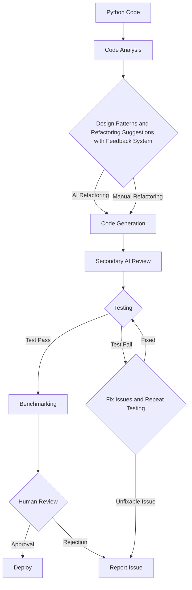

# AI Code Optimization Assistant

This project aims to assist software developers with refactoring and improving code quality using AI Agents.

## Overview

The assistant takes Python code as input and generates suggestions to refactor the code to improve readability, maintainability, performance etc. It goes through multiple stages:

### Code Analysis

- Parses the code into an abstract syntax tree (AST)
- Performs static analysis to gather metrics like cyclomatic complexity, code smells etc. 
- Extracts design patterns used

### Suggest Refactoring

- Analyzes the AST and metrics to suggest refactoring opportunities
- Applies heuristics and ML models to provide intelligent recommendations
- Provides interactive feedback loop for developers to guide refactoring

### Code Generation

- Applies suggested refactoring transformations on the AST
- Generates refactored Python code

### Testing & Validation

- Automated unit and integration testing to ensure functionality is preserved
- Regression testing against original test suite
- Benchmarking and profiling to validate performance gains
- Secondary AI review for quality and discrepancy detection
- Manual approval and tweaking by experienced developers

### Architecture

## Getting Started

### Prerequisites

- Python 3.6+
- AST parsing libraries like `ast`
- Static analysis libraries like `radon`
- Testing framework like `unittest` 
